# 💻 PC Builder E-commerce Platform

## 📌 Overview

This project is a full-stack web application that allows users to browse computer components, build custom PCs, and purchase products online.

The system also includes an admin dashboard for managing products, orders, and monitoring store performance.

---

## 🚀 Features

### 👤 User Features

* User registration and login system
* Browse and search for products
* Filter by category and specifications
* Add to cart and wishlist
* Build a custom PC
* Track orders and view purchase history

### 🛠️ Admin Features

* Dashboard with statistics (orders, revenue, users)
* Manage products (add, edit, delete)
* Manage orders and update status

---

## 🧠 System Design

The system is designed to be:

* User-friendly and responsive
* Secure (password hashing & validation)
* Scalable for handling multiple users

---

## 🛠️ Technologies Used

* PHP (Backend)
* MySQL (Database)
* HTML, CSS
* Bootstrap
* JavaScript
* XAMPP

---

## 📂 Project Structure

* `Pages/` → Frontend & Backend logic
* `Data/` → Sample data and database files
* `assets/` → Images and UI resources

---

## ▶️ How to Run

1. Install XAMPP
2. Import database file into phpMyAdmin
3. Place project folder in `htdocs`
4. Run Apache & MySQL
5. Open in browser:

```
http://localhost/PcBuilder
```

---

## 📸 Screenshots

### Homepage
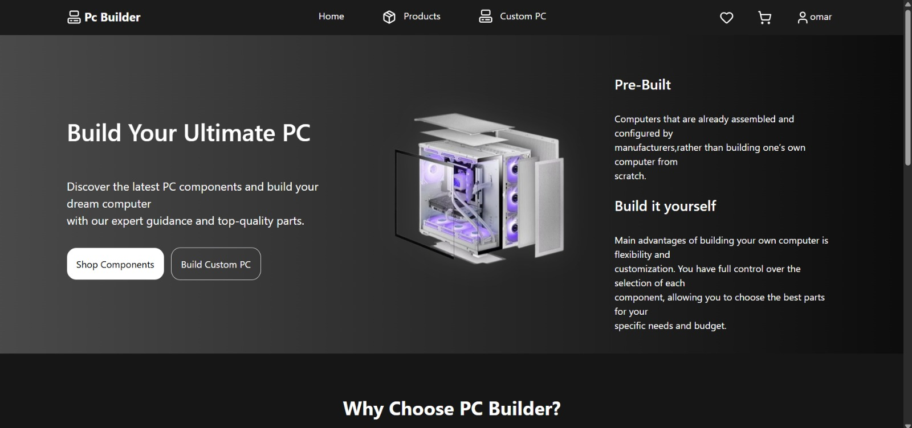

### Sign In
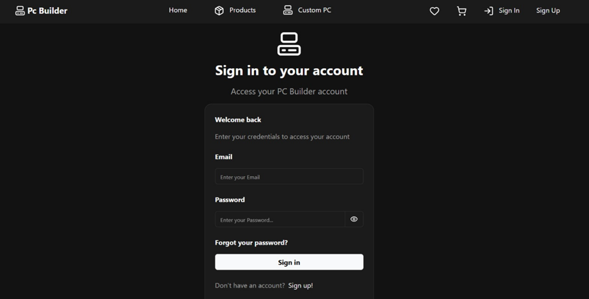

### Sign Up
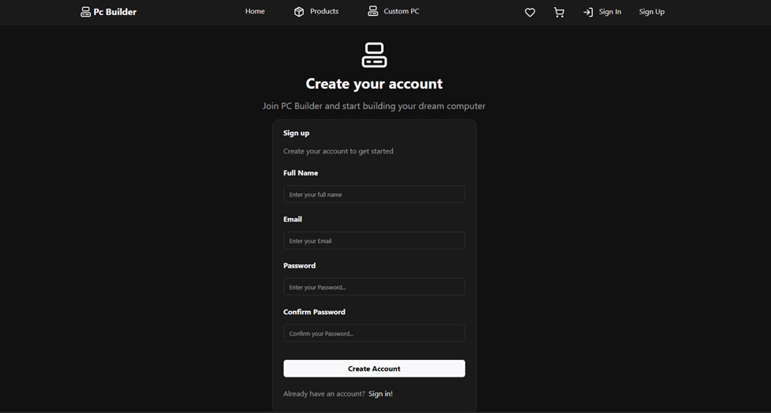

### Dashboard
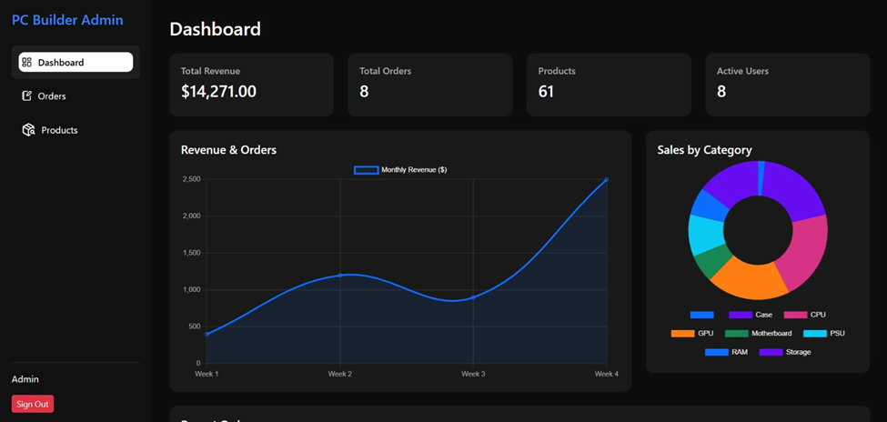

### Dashboard 2
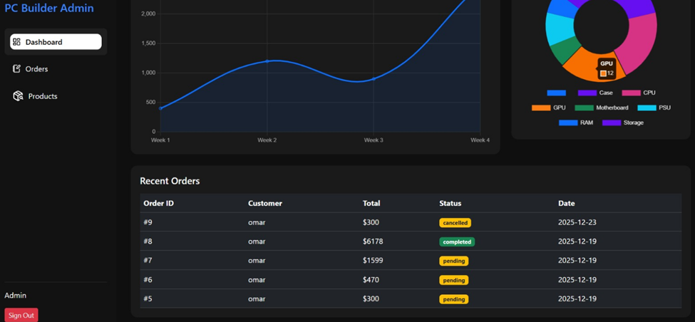

### Products
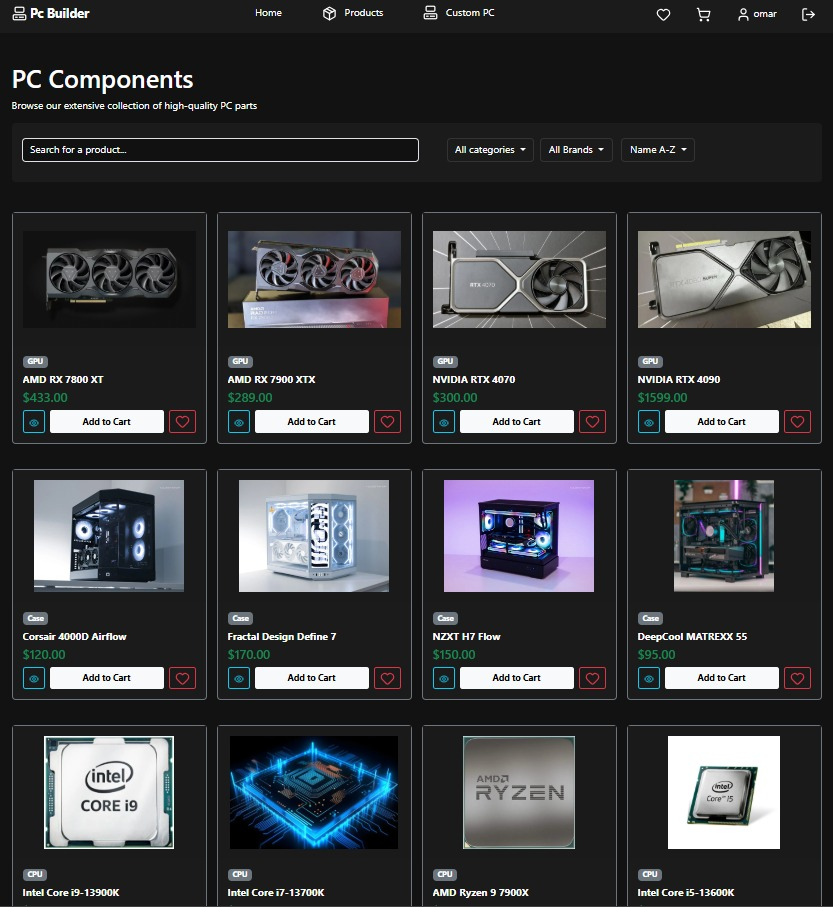

### Product Cart
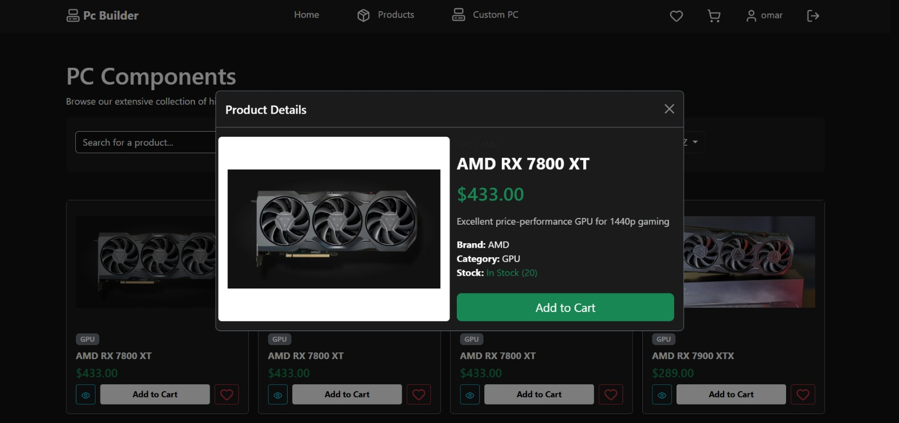

### Cart
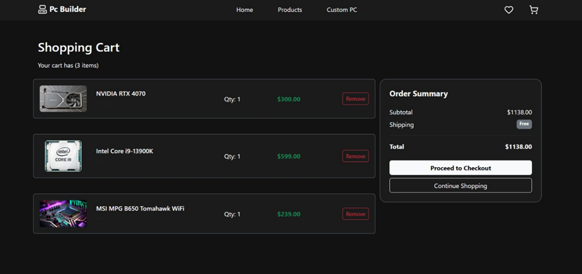

### Favorites
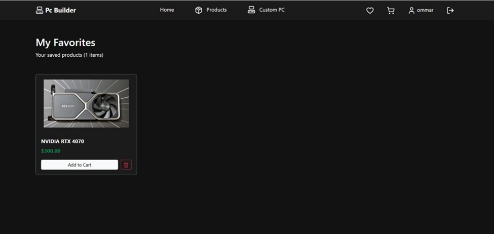

### Orders
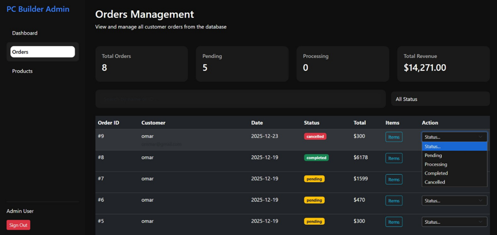

### Profile
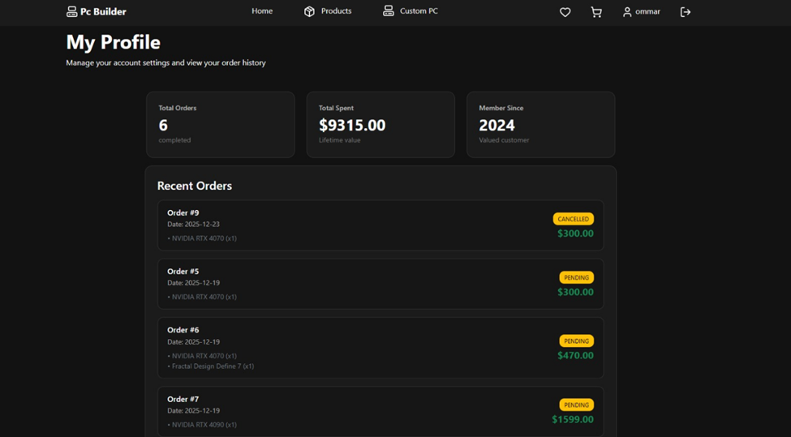

### Forgot Password
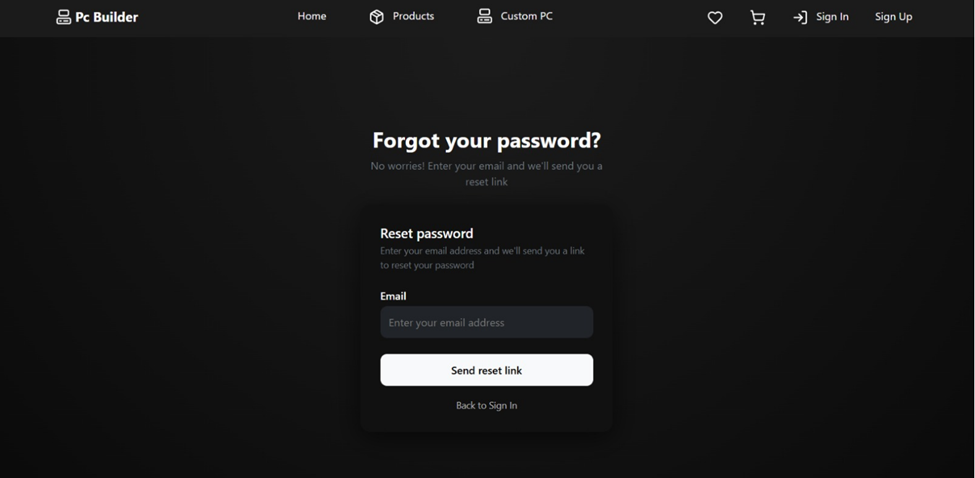

### Custom Page
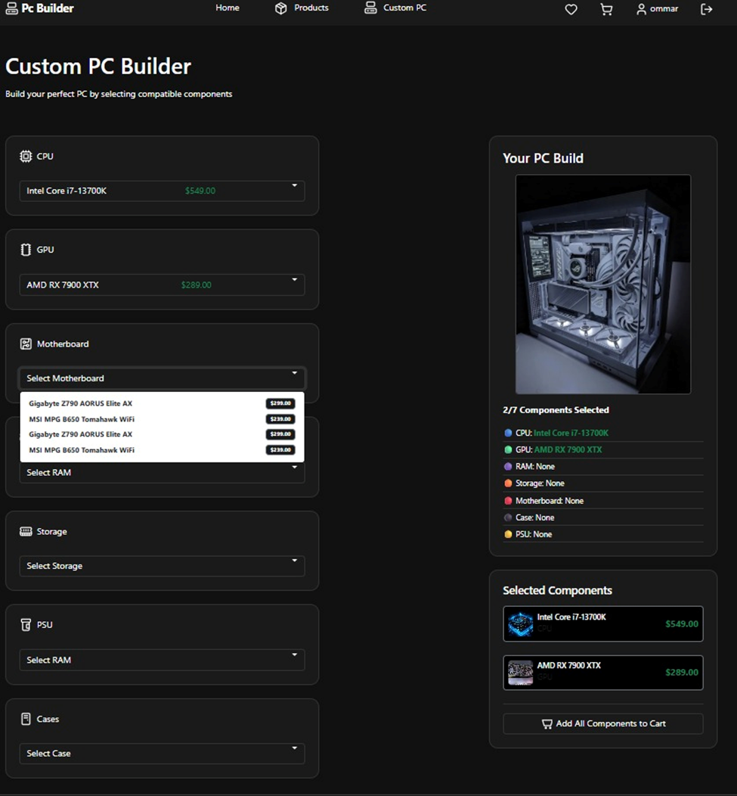

### Admin Products
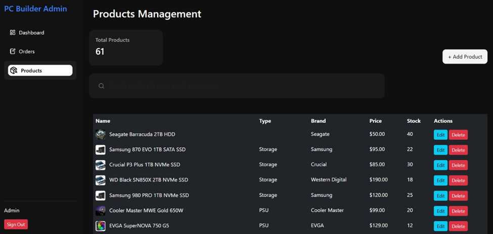
---

## 👨‍💻 Team

* Omar Farran
* Ibrahim Sharayaa

---

## 📌 Conclusion

This project provides a complete e-commerce solution for building custom PCs, offering a smooth experience for both customers and administrators.
